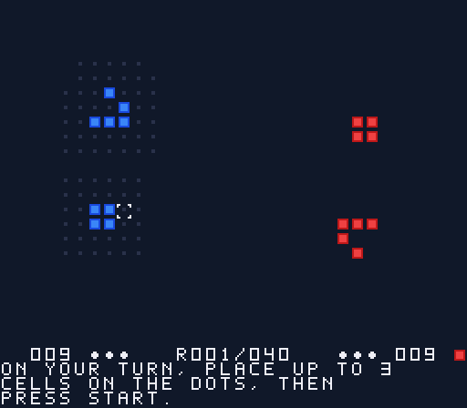

# Immigration — un jeu de la vie à deux joueurs pour Super Nintendo

Deux colonies de cellules, les Bleus et les Rouges, se disputent un petit monde de 32 × 24 cases. Personne ne tire, personne ne pioche de carte : les cellules naissent, vivent et meurent toutes seules, selon les lois implacables du jeu de la vie. Votre seul pouvoir est de glisser, à chaque tour, trois nouvelles recrues au bon endroit… puis de regarder le monde avancer en croisant les doigts.

## Comment gagner

Il y a deux façons de l'emporter :

1. **L'extinction.** Si, après une génération, l'adversaire n'a plus une seule cellule sur le plateau, vous gagnez sur-le-champ. Si les deux colonies disparaissent en même temps, personne ne gagne : c'est un match nul, et un plateau très calme.
2. **Le recensement.** Si personne n'a été éteint au bout de 40 rounds, on compte les cellules. La plus grosse colonie gagne ; à égalité, c'est nul.

## Les lois du monde

**Le monde est rond.** Enfin, torique : ce qui sort à droite revient par la gauche, ce qui sort en haut revient par le bas. Aucun coin où se cacher.

**Une génération, c'est trois règles :**

- une cellule qui a **2 ou 3 voisines** survit, parce qu'elle est bien entourée ;
- une cellule qui en a moins meurt d'ennui, et une qui en a plus meurt étouffée ;
- une case vide entourée d'**exactement 3 cellules** voit naître une nouvelle cellule. Elle prend la couleur **majoritaire** parmi ses trois parents : deux Bleus et un Rouge font un Bleu. C'est ça, l'*Immigration* — on peut convertir le territoire adverse.

**Un round se joue en quatre temps.** Le Bleu pose, le Rouge pose, le monde avance, puis on vérifie si quelqu'un a gagné.

**Vos poses.** Jusqu'à **3 cellules par tour**, sur une case vide, à **2 cases au plus** d'une de vos cellules : ce sont les petits points gris. La zone est figée au début du tour, donc pas question de ramper en enchaînant les poses. Pour conquérir un coin lointain, envoyez un planeur : ce petit motif traverse le plateau tout seul et vous ouvre une tête de pont là où il arrive.

**L'emballement.** À partir du round 16, le monde s'affole et avance de **deux générations** par round. Le bandeau affiche `×2`. Les colonies fragiles s'effondrent, et un coup bien placé peut faire tomber un camp entier.

**Le bandeau du bas** montre, de chaque côté, la population et les poses qu'il vous reste, et au centre le round en cours. La pastille du joueur qui a la main clignote.

## En images

| Menu | Portée de pose |
|---|---|
|  |  |
| **L'emballement, round 24** | **Le CPU vient de poser** |
|  |  |

| Écran de fin | Le tutoriel |
|---|---|
|  |  |

Le jeu tourne sur une vraie SNES ou dans un émulateur. Il se joue à deux sur la même console, ou seul contre un CPU à deux niveaux.

## Commandes

| Touche | En jeu | Au menu |
|---|---|---|
| Croix | déplacer le curseur (maintenir pour répéter) | changer de mode |
| A | poser une cellule | valider |
| B | annuler la dernière pose | — |
| SELECT | afficher ou masquer la portée | — |
| START | finir son tour | valider |

Le menu, sous le titre, propose trois modes et un tutoriel : `2 PLAYERS` pour jouer à deux, `VS CPU  EASY` contre le CPU facile, `VS CPU  HARD` contre le CPU normal, et `HOW TO PLAY`, une démo commentée d'une minute qui se joue toute seule (A passe à la leçon suivante, START revient au menu). Contre le CPU, le joueur humain joue le bleu. À l'écran de fin, START ramène au menu.

## Construire le jeu

Il faut macOS ou Linux, un compilateur C et Python 3. La logique du jeu se teste sans rien d'autre ; la ROM demande [PVSnesLib](https://github.com/alekmaul/pvsneslib) 4.6.0, installé dans `~/pvsneslib` ou désigné par `PVSNESLIB_HOME`.

```bash
make test          # tests unitaires de la logique, sur la machine hôte
make rom           # la ROM : build/life.sfc
make sim           # simulateur de parties IA contre IA : ./build/sim 200 1 easy
```

Deux variantes servent à la vérification sans manette :

```bash
make rom-script    # build/life-script.sfc : rejoue une séquence de touches fixée
make rom-measure   # build/life-measure.sfc : affiche la durée du tour du CPU
make rom-tutorial  # build/life-tutorial.sfc : démarre directement sur le tutoriel
```

Chaque build de ROM échoue si les variables statiques débordent dans la zone RAM réservée à PVSnesLib.

Sur macOS Apple Silicon, PVSnesLib s'installe en natif depuis l'archive de release :

```bash
curl -sL -o /tmp/pvsneslib.zip https://github.com/alekmaul/pvsneslib/releases/download/4.6.0/pvsneslib_460_64b_darwin_release.zip
unzip -q /tmp/pvsneslib.zip -d ~/pvsneslib
mv ~/pvsneslib/pvsneslib/* ~/pvsneslib/ && rmdir ~/pvsneslib/pvsneslib
```

## Publier une version

Le workflow **Release** (`.github/workflows/release.yml`) se lance à la main : onglet *Actions*, *Release*, *Run workflow*, puis saisir une version comme `v1.0.0`. Il installe PVSnesLib sur un runner Linux, lance les tests, construit la ROM et crée la release GitHub avec `immigration-<version>.sfc` en pièce jointe. Il refuse une version qui existe déjà. En ligne de commande :

```bash
gh workflow run release.yml -f version=v1.0.0
```

## Organisation du code

| Dossier | Contenu |
|---|---|
| `src/core/` | la logique du jeu en C89 portable, sans dépendance à la console : plateau, génération, règles de pose, déroulé du round, IA, vue |
| `src/snes/` | la partie console : rendu, manette, boucle de jeu, écrans |
| `tests/` | les tests unitaires de `src/core/` |
| `tools/` | `mktiles.py` (génère les tuiles) et `sim.c` (simulateur d'équilibrage) |
| `docs/` | la spécification, le plan, les mesures d'équilibrage et les notes techniques sur PVSnesLib |

La spécification du jeu est dans [`docs/superpowers/specs/`](docs/superpowers/specs/). Les mesures d'équilibrage sont dans [`docs/balance.md`](docs/balance.md). Les pièges de la chaîne PVSnesLib et de la console sont décrits dans [`docs/snes-notes.md`](docs/snes-notes.md) : `int` et `long` sur 16 bits, RAM non mise à zéro au démarrage, coût des calculs.

## Limites connues

- **L'équilibrage** reste à reprendre. Dans les parties simulées, l'élimination est rare (10 % au mieux) et le joueur 2 est avantagé.
- **Le tour du CPU normal** dure environ 3 secondes. Le bandeau reste animé pendant la réflexion.
- **Il n'y a ni son ni écran titre.**
