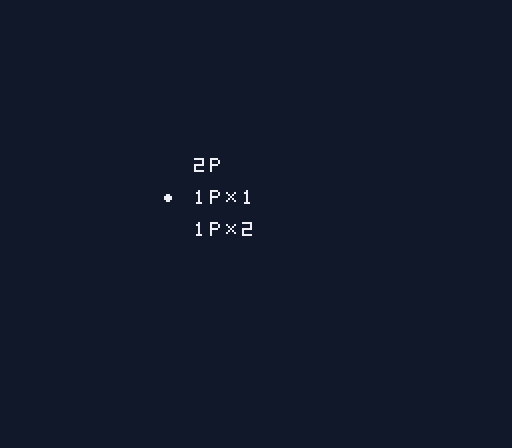
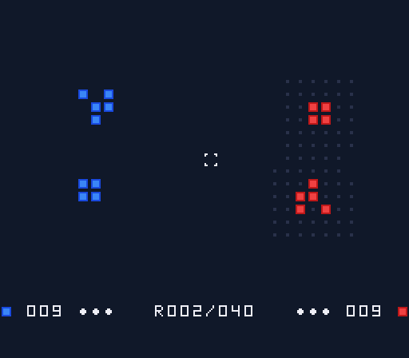
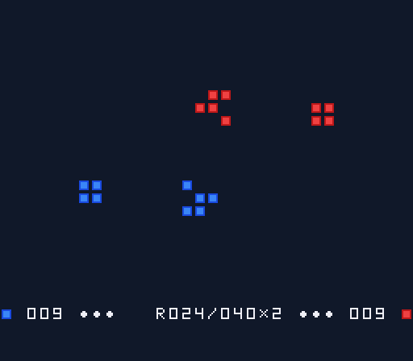
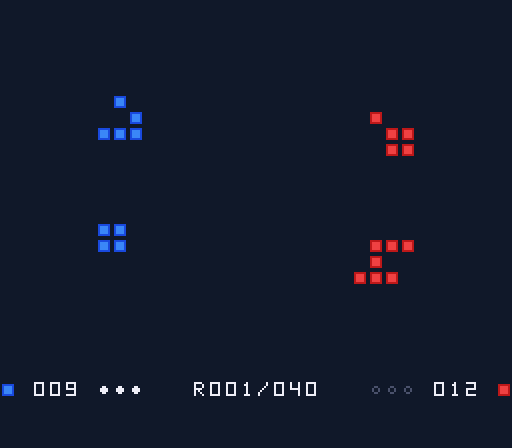
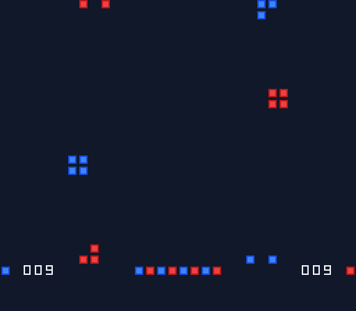

# Immigration — un jeu de la vie à deux joueurs pour Super Nintendo

Deux colonies, une bleue et une rouge, partagent un plateau torique de 32 × 24 cases qui évolue selon les règles du jeu de la vie. À chaque tour, chaque joueur pose jusqu'à trois cellules près de sa colonie. Puis le monde avance d'une génération. Le but est d'éteindre la colonie adverse, ou d'être le plus nombreux au bout de 40 rounds.

Le jeu tourne sur une vraie SNES ou dans un émulateur. Il se joue à deux sur la même console, ou seul contre un CPU à deux niveaux.

| Menu | Portée de pose |
|---|---|
|  |  |
| **L'emballement, round 24** | **Le CPU vient de poser** |
|  |  |



## Règles

- **Le plateau** fait 32 × 24 cases et se referme sur lui-même : ce qui sort à droite rentre à gauche, ce qui sort en haut rentre en bas.
- **Une génération** suit les règles de Conway. Une cellule vivante survit avec 2 ou 3 voisines. Une case vide avec exactement 3 voisines donne naissance à une cellule, de la couleur majoritaire parmi ces trois voisines : c'est la variante *Immigration*.
- **Un round** se déroule en quatre temps : le bleu pose, le rouge pose, puis le plateau évolue, puis on contrôle la victoire.
- **Les poses** sont limitées à 3 par tour, sur une case vide à distance 2 au plus d'une de ses cellules. La portée est figée au début du tour : une cellule qu'on vient de poser ne l'étend pas. Envoyer un planeur à l'autre bout du plateau ouvre donc une tête de pont.
- **L'emballement** commence au round 16 : chaque round fait alors évoluer le plateau de deux générations. Le bandeau affiche `×2`.
- **La victoire** revient au joueur dont l'adversaire n'a plus aucune cellule après une génération. Si les deux colonies s'éteignent en même temps, la partie est nulle. Au bout du round 40, la plus grosse population gagne, et une égalité donne un nul.

Le bandeau du bas affiche la population de chaque joueur, ses poses restantes et le round en cours. La pastille du joueur qui a la main clignote.

## Commandes

| Touche | En jeu | Au menu |
|---|---|---|
| Croix | déplacer le curseur (maintenir pour répéter) | changer de mode |
| A | poser une cellule | valider |
| B | annuler la dernière pose | — |
| SELECT | afficher ou masquer la portée | — |
| START | finir son tour | valider |

Les trois modes du menu sont : `2P` pour deux joueurs, `1P×1` contre le CPU facile et `1P×2` contre le CPU normal. Contre le CPU, le joueur humain joue le bleu. À l'écran de fin, START ramène au menu.

## Construire le jeu

Il faut macOS ou Linux, un compilateur C et Python 3. La logique du jeu se teste sans rien d'autre ; la ROM demande [PVSnesLib](https://github.com/alekmaul/pvsneslib) 4.6.0, installé dans `~/pvsneslib` ou désigné par `PVSNESLIB_HOME`.

```bash
make test          # tests unitaires de la logique, sur la machine hôte
make rom           # la ROM : build/life.sfc
make sim           # simulateur de parties IA contre IA : ./build/sim 200 1 easy
```

Deux variantes servent à la vérification sans manette :

```bash
make rom-script    # build/life-script.sfc : rejoue une séquence de touches fixée
make rom-measure   # build/life-measure.sfc : affiche la durée du tour du CPU
```

Chaque build de ROM échoue si les variables statiques débordent dans la zone RAM réservée à PVSnesLib.

Sur macOS Apple Silicon, PVSnesLib s'installe en natif depuis l'archive de release :

```bash
curl -sL -o /tmp/pvsneslib.zip https://github.com/alekmaul/pvsneslib/releases/download/4.6.0/pvsneslib_460_64b_darwin_release.zip
unzip -q /tmp/pvsneslib.zip -d ~/pvsneslib
mv ~/pvsneslib/pvsneslib/* ~/pvsneslib/ && rmdir ~/pvsneslib/pvsneslib
```

## Organisation du code

| Dossier | Contenu |
|---|---|
| `src/core/` | la logique du jeu en C89 portable, sans dépendance à la console : plateau, génération, règles de pose, déroulé du round, IA, vue |
| `src/snes/` | la partie console : rendu, manette, boucle de jeu, écrans |
| `tests/` | les tests unitaires de `src/core/` |
| `tools/` | `mktiles.py` (génère les tuiles) et `sim.c` (simulateur d'équilibrage) |
| `docs/` | la spécification, le plan, les mesures d'équilibrage et les notes techniques sur PVSnesLib |

La spécification du jeu est dans [`docs/superpowers/specs/`](docs/superpowers/specs/). Les mesures d'équilibrage sont dans [`docs/balance.md`](docs/balance.md). Les pièges de la chaîne PVSnesLib et de la console sont décrits dans [`docs/snes-notes.md`](docs/snes-notes.md) : `int` et `long` sur 16 bits, RAM non mise à zéro au démarrage, coût des calculs.

## Limites connues

- **L'équilibrage** reste à reprendre. Dans les parties simulées, l'élimination est rare (10 % au mieux) et le joueur 2 est avantagé.
- **Le tour du CPU normal** dure environ 3 secondes. Le bandeau reste animé pendant la réflexion.
- **Il n'y a ni son ni écran titre.**
